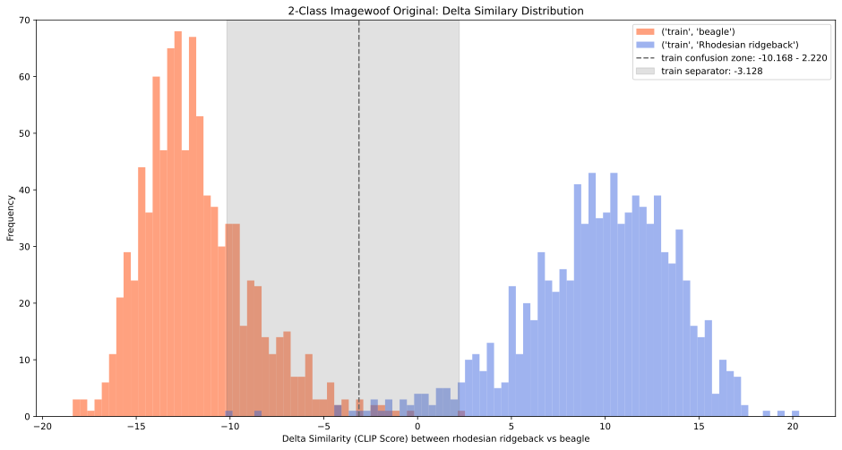
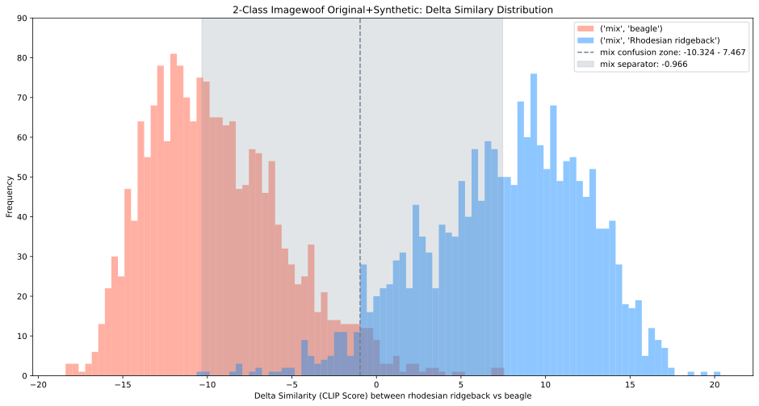
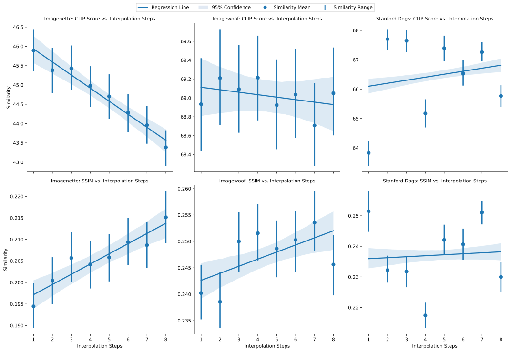

# Generative Data Augmentation

This repository contains the code for the experiments in the 'Improving Fine-Grained Image Classification Using Diffusion-Based Generated Synthetic Images' dissertation.

<div align="center">
 Try the HuggingFace 🤗 demo
 <p>
 <a href="https://huggingface.co/spaces/czl/generative-data-augmentation-demo">Generative Data Augmentation</a> | <a href="https://huggingface.co/spaces/czl/generative-augmented-classifiers">Generative Augmented Classifiers</a>
 </p>
</div>

## Table of Contents

- [Generative Data Augmentation](#generative-data-augmentation)
  - [Table of Contents](#table-of-contents)
  - [Data Augmentation with Image-to-Image Stable Diffusion using Prompt Interpolation](#data-augmentation-with-image-to-image-stable-diffusion-using-prompt-interpolation)
  - [Requirements](#requirements)
    - [Setup](#setup)
    - [Files](#files)
  - [Datasets](#datasets)
    - [Original Datasets](#original-datasets)
    - [Generated Datasets](#generated-datasets)
    - [Preparing the Dataset](#preparing-the-dataset)
  - [Models used in the Experiments](#models-used-in-the-experiments)
  - [Trained Classifiers](#trained-classifiers)
    - [Results](#results)
    - [CLIP Similarity Scores between 2 Classes across Datasets](#clip-similarity-scores-between-2-classes-across-datasets)
    - [Similarity Overview](#similarity-overview)
    - [Classifier Performance](#classifier-performance)

## Data Augmentation with Image-to-Image Stable Diffusion using Prompt Interpolation

The code for generating images using the Stable Diffusion model with prompt interpolation is the `imageGen.py` script.


To replicate the results, use the following seed values:

1. Imagenette: 18316237598377439927
2. Imagewoof: 4796730343513556238
3. Stanford Dogs: 1127962904372660145

For Imagenette, use the prompt_format `A photo of a {class}`.
For Imagewoof and Stanford Dogs, use the prompt_format `A photo of a {class}, a type of dog`.

Leave the rest of the parameters as default.

Run the `imageGen_trace.py` script independently to generate the trace files for the generated images.

## Requirements

- Both Linux and Windows are supported, however Linux is recommended for performance and compatibility reasons.
- 64-bit Python 3.11.* and PyTorch 2.1.2. See the [PyTorch website](https://pytorch.org/get-started/previous-versions/#v212) for installation instructions.
- The experiments were conducted on: `AMD Ryzen 7 5700G`, `NVIDIA GeForce RTX 3080 12GB`, `32GB RAM`.

### Setup

```bash
git clone https://github.com/zhulinchng/generative-data-augmentation.git
cd generative-data-augmentation
# Setup the data directory structure as shown above
conda create --name $env_name python=3.11.* # Replace $env_name with your environment name
conda activate $env_name
# Visit PyTorch website https://pytorch.org/get-started/previous-versions/#v212 for PyTorch installation instructions.
pip install torch==2.1.2 torchvision==0.16.2 torchaudio==2.1.2 --index-url # Obtain the correct URL from the PyTorch website
pip install -r requirements.txt
# Configure the imageGen.py script with the target parameters.
torchrun imageGen.py
```

### Files

- [Image Generation](imageGen.py) generates the images based on the input images from the original dataset and interpolated prompts.
  - [Image Generation Trace](imageGen_trace.py) generates the trace files for the generated images, for analysis and debugging purposes.
- [Classifier Training](trainClassifier.py) trains the classifiers on the **training** set of the desired dataset.
  - [Classifier Evaluation](validateClassifier.ipynb) evaluates the classifiers on the **validation** set of the desired dataset.
- **Analysis Notebook** a series of Jupyter notebooks for the analysis of the generated images and classifiers.
  - [Classifier Performance Visualization](analysis_Classifier.ipynb) visualizes the performance of the classifiers from the wandb exports.
  - [CLIP Similarity Analysis](analysis_CLIP.ipynb) analyzes the CLIP similarity scores of the generated images, with the option to analyze with the classifiers.
  - [Dataset Analysis](analysis_Dataset.ipynb) analyzes the dataset counts and interpolation distribution.
  - [Similarity Analysis](analysis_Similarity.ipynb) analyzes the CLIP and SSIM similarity scores over the distribution of the generated images.
- [Tools](tools/) contains the helper scripts for the experiments.
  - [analysis.py](tools/analysis.py) contains the analysis functions for the experiments.
  - [classes.py](tools/classes.py) contains the classes for the dataset and the classifiers.
  - [data.py](tools/data.py) contains the data loading functions for the dataset.
  - [synth.py](tools/synth.py) contains the functions for the synthetic dataset generation.
  - [transform.py](tools/transform.py) contains the transformations for the dataset.
  - [utils.py](tools/utils.py) contains the utility scripts for training and evaluation of the classifiers.
- [Results](results/) contains the results of the experiments.

## Datasets

### Original Datasets

1. [Imagenette](https://s3.amazonaws.com/fast-ai-imageclas/imagenette2.tgz)
2. [Imagewoof](https://s3.amazonaws.com/fast-ai-imageclas/imagewoof2.tgz)
3. [Stanford Dogs](http://vision.stanford.edu/aditya86/ImageNetDogs/images.tar)

### Generated Datasets

1. [Imagenette](https://huggingface.co/datasets/czl/generated-imagenette/tree/main)
2. [Imagewoof](https://huggingface.co/datasets/czl/generated-imagewoof/tree/main)
3. [Stanford Dogs](https://huggingface.co/datasets/czl/generated-stanford-dogs/tree/main)

The generated datasets are located in the `synthetic` folder.
The files for the noisy and clean versions can be found in the text files within `metadata` folder.

### Preparing the Dataset

Follow the directory structure below for the datasets:

```bash
data/
├── imagenette-original/
│   ├── train/
│   │   ├── n01440764/
│   │   │   ├── n01440764_1775.JPEG
│   │   │   └── ...
│   │   └── ...
│   └── val/
│       ├── n01440764/
│       │   ├── n01440764_1775.JPEG
│       │   └── ...
│       └── ...
├── imagenette-augmented-noisy/
│   ├── train/
│   │   ├── n01440764/
│   │   │   ├── n01440764_1775.JPEG
│   │   │   └── ...
│   │   └── ...
│   └── val/
│       ├── n01440764/
│       │   ├── n01440764_1775.JPEG
│       │   └── ...
│       └── ...
├── imagenette-augmented-clean/
│   ├── train/
│   │   ├── n01440764/
│   │   │   ├── n01440764_1775.JPEG
│   │   │   └── ...
│   │   └── ...
│   └── val/
│       ├── n01440764/
│       │   ├── n01440764_1775.JPEG
│       │   └── ...
│       └── ...    
├── imagenette-synthetic/
│   ├── train/
│   │   ├── n01440764/
│   │   │   ├── n01440764_1775.JPEG
│   │   │   └── ...
│   │   └── ...
│   └── val/
│       ├── n01440764/
│       │   ├── n01440764_1775.JPEG
│       │   └── ...
│       └── ...
└── ...
```

## Models used in the Experiments

- The default `runwayml/stable-diffusion-v1-5` model is used for generating images for data augmentation, which can be obtained from the [HuggingFace model hub](https://huggingface.co/runwayml/stable-diffusion-v1-5).
- CLIP analysis is performed using the `openai/clip-vit-large-patch14` model, which can be obtained from the [HuggingFace model hub](https://huggingface.co/openai/clip-vit-large-patch14).

## Trained Classifiers

The trained classifiers are available on the HuggingFace model hub: [Generative Augmented Classifiers](https://huggingface.co/spaces/czl/generative-augmented-classifiers).


In the demo, you have the option to select the classifier to evaluate the generated images and download the model for further evaluation.
Alternatively, navigate to the `models` [folder](https://huggingface.co/spaces/czl/generative-augmented-classifiers/tree/main/models) to download the classifiers.

### Results

### CLIP Similarity Scores between 2 Classes across Datasets






### Similarity Overview



### Classifier Performance

| Model       | Methods                      | Imagenette Acc@1  | Imagewoof Acc@1   | Stanford Dogs Acc@1 | Stanford Dogs Acc@5 |
| ----------- | ---------------------------- | ----------------- | ----------------- | ------------------- | ------------------- |
| ResNet-18   | Original                     | 89.91             | 83.43             | 58.12               | 84.48               |
| ResNet-18   | Synthetic                    | (-24.69) 65.22    | (-35.17) 48.26    | (-44.71) 13.41      | (-48.23) 36.25      |
| ResNet-18   | Original + Synthetic (Noisy) | (+1.55) 91.46     | (+1.93) 85.37     | **(+2.56) 60.69**   | **(+2.34) 86.82**   |
| ResNet-18   | Original + Synthetic (Clean) | **(+1.73) 91.64** | **(+3.18) 86.61** | -                   | -                   |
| MobileNetV2 | Original                     | 92.28             | 86.77             | 64.93               | 89.87               |
| MobileNetV2 | Synthetic                    | (-25.15) 67.13    | (-40.57) 46.19    | (-48.67) 16.26      | (-48.28) 41.60      |
| MobileNetV2 | Original + Synthetic (Noisy) | (-0.13) 92.15     | (+0.92) 87.68     | **(+1.29) 66.22**   | **(+1.32) 91.19**   |
| MobileNetV2 | Original + Synthetic (Clean) | **(+0.61) 92.89** | **(+1.15) 87.91** | -                   | -                   |
